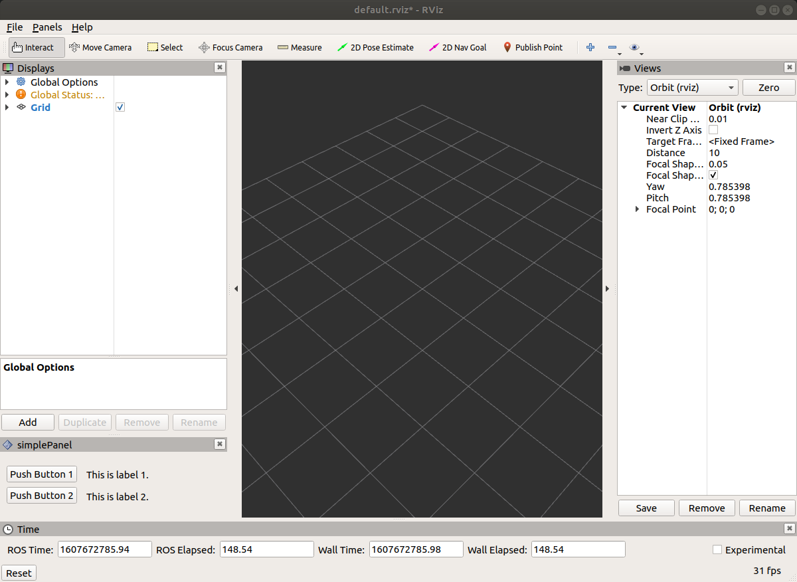

# RViz Panel

This repository demonstrates the method for writing a rviz dockable panel.

Note that to generate the `ui*.h` file you will need to use the `add_library` or `add_executable` function for it to appear.



## Steps

Note that plugin.xml class name should be unique for ROS to locate it. Otherwise, only the first that registered is found.

1. [Create Package](###Create-Package)
1. [Create Necessary Folders and Files](###Folder-Structure)
1. [Create UI file with Qt Designer](https://github.com/BruceChanJianLe/ros-rqt-plugin#ui-file)
1. [Update package.xml (update export tag)](###Packagexml)
1. [Update CMakeLists.txt](###CMake)
1. [Compile to create header file from UI file (catkin_make)](###UI-Header)
1. [Create and update header file (inside of include/<package_name>)](###Header-File)
1. [Create and update source file (inside of src)](###Source-File)
1. [Compile (catkin_make)]

### Create Package

Create your personal ROS RViz panel/plugin with the following command:
```bash
catkin_create_pkg rviz-panel roscpp rospy pluginlib rviz std_msgs
```
Please choose carefully your packages, here std_msgs is no needed to actually build the panel.  

### Folder-Structure
```bash
├── CMakeLists.txt
├── include
│   └── rviz-panel
│       └── rviz_panel.hpp  # Header File
├── package.xml
├── resource
│   └── simple_panel.ui     # UI File
├── rviz_plugin.xml         # Declare plugin
└── src
    └── rviz_panel.cpp      # Source File
```

### Package.xml
Do not forget to add export tag correctly.
```xml
<?xml version="1.0"?>
<package format="2">
  <name>rviz-panel</name>
  <version>0.0.0</version>
  <description>The rviz-panel package</description>

  <author email="jianle001@e.ntu.edu.sg">Bruce Chan Jian Le</author>
  <maintainer email="jianle001@e.ntu.edu.sg">Bruce Chan Jian Le</maintainer>
  <license>MIT</license>
  <url type="website">https://github.com/BruceChanJianLe/rviz-panel</url>


  <buildtool_depend>catkin</buildtool_depend>

  <build_depend>roscpp</build_depend>
  <build_depend>rospy</build_depend>
  <build_depend>rviz</build_depend>
  <build_depend>pluginlib</build_depend>
  <build_depend>std_msgs</build_depend>

  <build_export_depend>roscpp</build_export_depend>
  <build_export_depend>rospy</build_export_depend>
  <build_export_depend>rviz</build_export_depend>
  <build_export_depend>pluginlib</build_export_depend>
  <build_export_depend>std_msgs</build_export_depend>

  <exec_depend>roscpp</exec_depend>
  <exec_depend>rospy</exec_depend>
  <exec_depend>rviz</exec_depend>
  <exec_depend>pluginlib</exec_depend>
  <exec_depend>std_msgs</exec_depend>


  <export>
    <rviz plugin="${prefix}/rviz_plugin.xml"/>
  </export>

</package>
```

### CMake
```cmake
cmake_minimum_required(VERSION 3.0.2)
project(rviz-panel)

set(CMAKE_CXX_STANDARD 11)
set(CMAKE_CXX_STANDARD_REQUIRED ON)

find_package(catkin REQUIRED COMPONENTS
  roscpp
  rospy
  rviz
  pluginlib
  # Other dependecies
  std_msgs
)

catkin_package(
  INCLUDE_DIRS include
  # LIBRARIES rviz-panel
  # CATKIN_DEPENDS roscpp rospy rviz
  # DEPENDS system_lib
)

include_directories(
  include
  ${catkin_INCLUDE_DIRS}
  ${CMAKE_CURRENT_BINARY_DIR}
)

## This setting causes Qt's "MOC" generation to happen automatically.
set(CMAKE_AUTOMOC ON)

## This plugin includes Qt widgets, so we must include Qt.
## We'll use the version that rviz used so they are compatible.
if(rviz_QT_VERSION VERSION_LESS "5")
  message(STATUS "Using Qt4 based on the rviz_QT_VERSION: ${rviz_QT_VERSION}")
  find_package(Qt4 ${rviz_QT_VERSION} EXACT REQUIRED QtCore QtGui)
  ## pull in all required include dirs, define QT_LIBRARIES, etc.
  include(${QT_USE_FILE})
else()
  message(STATUS "Using Qt5 based on the rviz_QT_VERSION: ${rviz_QT_VERSION}")
  find_package(Qt5 ${rviz_QT_VERSION} EXACT REQUIRED Core Widgets)
  ## make target_link_libraries(${QT_LIBRARIES}) pull in all required dependencies
  set(QT_LIBRARIES Qt5::Widgets)
endif()

# Avoid keyword definition to avaid conflicts with boost or xapian etc
# e.g. http://muddyazian.blogspot.de/2012/04/getting-qt-app-working-with-boost-using.html
add_definitions(-DQT_NO_KEYWORDS)

# Define source file
set(${PROJECT_NAME}_SRCS
  src/rviz_panel.cpp
)

# Define header file
set(${PROJECT_NAME}_HDRS
  include/${PROJECT_NAME}/rviz_panel.hpp
)

# Define ui file
set(${PROJECT_NAME}_UIS
  resource/simple_panel.ui
)

# Create header from ui file (uic)
if(rviz_QT_VERSION VERSION_LESS "5")
    message(STATUS "Generate header for ui with rviz_QT_VERSION: ${rviz_QT_VERSION}")
    qt4_wrap_ui(${PROJECT_NAME}_UIS_H ${${PROJECT_NAME}_UIS})
    qt4_wrap_cpp(${PROJECT_NAME}_MOCS ${${PROJECT_NAME}_HDRS})
else()
    message(STATUS "Generate header for ui with rviz_QT_VERSION: ${rviz_QT_VERSION}")
    qt5_wrap_ui(${PROJECT_NAME}_UIS_H ${${PROJECT_NAME}_UIS})
    qt5_wrap_cpp(${PROJECT_NAME}_MOCS ${${PROJECT_NAME}_HDRS})
endif()

## Add library is needed in order to generate the header file from ui file.
add_library(simple_panel
  ${${PROJECT_NAME}_SRCS}
  ${${PROJECT_NAME}_UIS_H}
  ${${PROJECT_NAME}_MOCS} 
)

target_link_libraries(simple_panel
  ${catkin_LIBRARIES}
  ${QT_LIBRARIES}
)
```

### UI Header

In order to generate the header file from the UI file, you will need to use the add_library function to invoke CMakeLists.txt to create the header file. The header file will be inside of the build directory. To use the header file in vscode you may have to use `#include <package_name/ui_header.h` but to compile it, you will need to change it to `#include <ui_header.h>`.

To include the ui header file, you need to include this cmake binary directory which is the build file.
```cmake
include_directories(
  include
  ${catkin_INCLUDE_DIRS}
  ${CMAKE_CURRENT_BINARY_DIR}       # To include UI header file
)
``` 

### Header File
The main header file.
```cpp
#ifndef rviz_panel_H_
#define rviz_panel_H_

#include <ros/ros.h>
#include <rviz/panel.h>

/** 
 *  Include header generated from ui file
 *  Note that you will need to use add_library function first
 *  in order to generate the header file from ui.
 */
#include <ui_simple_panel.h>

// Other ROS dependencies
#include <std_msgs/Bool.h>


namespace rviz_panel
{
    /**
     *  Here we declare our new subclass of rviz::Panel. Every panel which
     *  can be added via the Panels/Add_New_Panel menu is a subclass of
     *  rviz::Panel.
     */

    class simplePanel : public rviz::Panel
    {
        /**
         * This class uses Qt slots and is a subclass of QObject, so it needs
         * the Q_OBJECT macro.
         */
        Q_OBJECT

        public:
            /**
             *  QWidget subclass constructors usually take a parent widget
             *  parameter (which usually defaults to 0).  At the same time,
             *  pluginlib::ClassLoader creates instances by calling the default
             *  constructor (with no arguments). Taking the parameter and giving
             *  a default of 0 lets the default constructor work and also lets
             *  someone using the class for something else to pass in a parent
             *  widget as they normally would with Qt.
             */
            simplePanel(QWidget * parent = 0);

            /**
             *  Now we declare overrides of rviz::Panel functions for saving and
             *  loading data from the config file.  Here the data is the topic name.
             */
            virtual void save(rviz::Config config) const;
            virtual void load(const rviz::Config & config);

        /**
         *  Next come a couple of public Qt Slots.
         */
        public Q_SLOTS:

        /**
         *  Here we declare some internal slots.
         */
        private Q_SLOTS:

            void button_one();
            void button_two();

        /**
         *  Finally, we close up with protected member variables
         */
        protected:
            // UI pointer
            std::shared_ptr<Ui::two_button> ui_;
            // ROS declaration
            ros::NodeHandle nh_;
            ros::Publisher button_1_pub_;
            ros::Publisher button_2_pub_;
            std_msgs::Bool msg_;
    };
} // namespace rviz_panel
#endif
```

### Source File
```cpp
#include "rviz-panel/rviz_panel.hpp"
#include <pluginlib/class_list_macros.hpp>


PLUGINLIB_EXPORT_CLASS(rviz_panel::simplePanel, rviz::Panel)

namespace rviz_panel
{
    simplePanel::simplePanel(QWidget * parent)
    :   rviz::Panel(parent),
        ui_(std::make_shared<Ui::two_button>())
    {
        // Extend the widget with all attributes and children from UI file
        ui_->setupUi(this);

        // Define ROS publisher
        button_1_pub_ = nh_.advertise<std_msgs::Bool>("button_1_topic", 1);
        button_2_pub_ = nh_.advertise<std_msgs::Bool>("button_2_topic", 1);

        // Declare ROS msg_
        msg_.data = true;

        connect(ui_->pushButton_1, SIGNAL(clicked()), this, SLOT(button_one()));
        connect(ui_->pushButton_2, SIGNAL(clicked()), this, SLOT(button_two()));
    }


    void simplePanel::button_one()
    {
        ROS_INFO_STREAM("Button one pressed.");
        button_1_pub_.publish(msg_);
    }


    void simplePanel::button_two()
    {
        ROS_INFO_STREAM("Button two pressed.");
        button_2_pub_.publish(msg_);
    }


    /**
     *  Save all configuration data from this panel to the given
     *  Config object. It is important here that you call save()
     *  on the parent class so the class id and panel name get saved.
     */
    void simplePanel::save(rviz::Config config) const
    {
        rviz::Panel::save(config);
    }

    /**
     *  Load all configuration data for this panel from the given Config object.
     */
    void simplePanel::load(const rviz::Config & config)
    {
        rviz::Panel::load(config);
    }
} // namespace rviz_panel
```

## Reference

- RViz Panel Example (repository) [link](https://github.com/ros-visualization/visualization_tutorials/tree/8284284b3894a7c7c9298e2018f040894daa4779/rviz_plugin_tutorials)
- RViz Panel from ui file [link](https://answers.ros.org/question/241811/build-rviz-plugin-from-ui-file/)
- Simple RViz Plugin (repository) [link](https://gitlab.com/InstitutMaupertuis/simple_rviz_plugin)
- Question on uic [link](https://www.qtcentre.org/threads/35960-How-to-convert-ui-file-to-cpp-file-in-QtCreator)
- RViz Panel Example 2 (repository) [link](https://github.com/davetcoleman/moveit_dashboard)